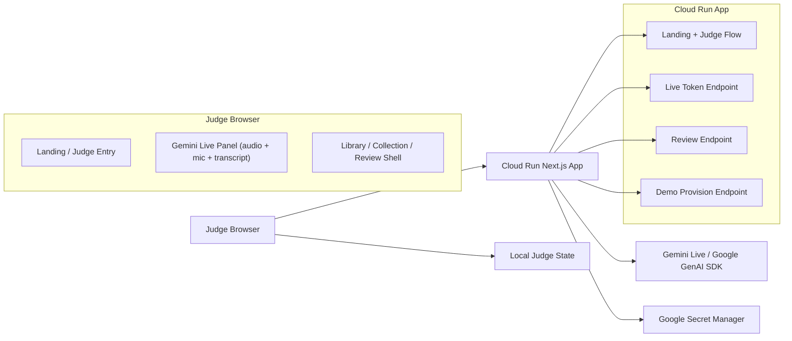

# Architecture Diagram

## Notes

- The challenge repo is intentionally isolated from production Joe Speaking.
- Gemini is the only AI provider exposed in this build.
- Cloud Run is the canonical host.
- The public judge demo uses local challenge state instead of a shared external data service.
- The browser panel requests an ephemeral live token from Cloud Run, then connects directly to Gemini Live for the active session.
